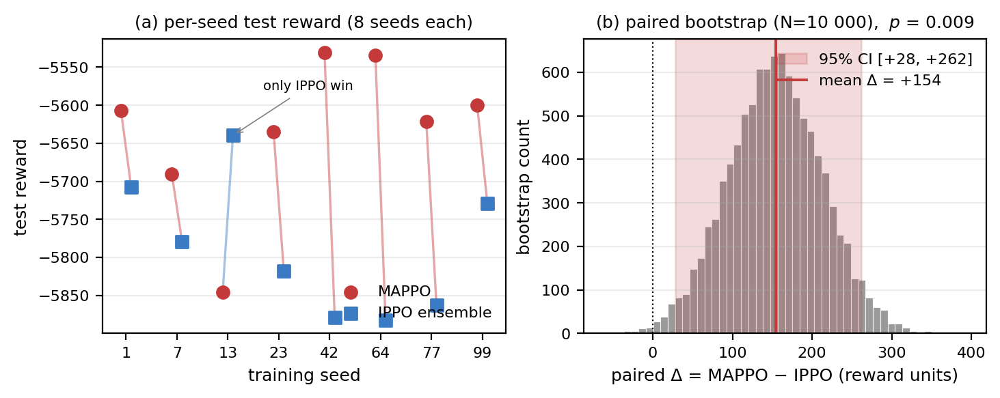

# Cooperative MARL for Energy-Aware UPF Realisation Switching at the 5G Edge

> **Target:** IEEE Networking Letters. 5-page limit (≤4 pages free,
> 5th page US$220). 75–100 word abstract. IEEE Style Files (LaTeX);
> this draft is markdown for editing convenience. EDICS classification
> + ORCID required at submission.

**Authors.**

- **Shima Afshar Borji**$^{1,*}$ — `shima.afshar.borji@edu.unige.it`
- **Roberto Bruschi**$^{1,2}$ — `roberto.bruschi@unige.it`
- **Chiara Lombardo**$^{1,2}$ — `chiara.lombardo@unige.it`
- **Raffaele Bolla**$^{1,2}$ — `raffaele.bolla@unige.it`
- **Cristina Emilia Costa**$^{2}$ — `ccosta@cnit.it`

$^{1}$DITEN — University of Genoa, Genoa, Italy.
$^{2}$CNIT — S2N National Lab, Genoa, Italy.
$^{*}$Corresponding author.

**ORCIDs.** [TODO — required at submission; fill from authors.]

**Index Terms.** 5G User Plane Function, multi-agent reinforcement
learning, MAPPO, centralised training decentralised execution,
energy efficiency, mobile edge computing.

**EDICS.** NL1.9 — Network Operations and Management. *(Primary
category from the IEEE Networking Letters EDICS list; the
controller targets per-site orchestration of UPF realisations, a
network-management problem. The Letters EDICS list does not yet
contain dedicated codes for "AI/ML for networks", "5G core / NFV",
"edge computing", or "energy efficiency", so a single primary
classification is the cleanest pick. If the editor requires a
secondary, NL1.8.1 Flow/Congestion Control is the closest
secondary fit.)*

## Abstract

5G User Plane Function instances at the edge can run as DPDK
kernel-bypass (high throughput, high idle power) or as user-space
(lower power, narrower envelope). We cast per-site switching
across $K\!=\!10$ heterogeneous edge clusters as cooperative
MARL with a reward that folds the digital twin's measured
switching energy into specific energy consumption, removing the
parallel flat-cost term used in prior work. On a 10.5-day held-out
test slice, MAPPO attains $-5633\!\pm\!100$ reward over 8 seeds,
beating independent-PPO ($-5787\!\pm\!89$; paired-bootstrap
95 % CI $[+28,+262]$, $p\!=\!0.009$), centralised single-MLP PPO,
and the swept-best classical hysteresis baseline by 10–61 %.

*(93 words. Range: 75–100.)*

## I. Introduction

The 5G core's User Plane Function is the highest-throughput
data-plane element in a typical edge deployment. Two realisations
are common: a DPDK-accelerated kernel-bypass stack (high throughput,
high idle power) and a user-space stack (lower power, narrower
operating envelope). Static all-DPDK wastes energy at low load;
static all-USR violates QoS at peaks. The right realisation depends
on the per-site forecast and on a non-trivial switching cost.
Coordinating this choice across many edge clusters is a cooperative
control problem whose joint policy space scales as $2^K$ for $K$
clusters.

Prior work [TODO cite: COMCOM-S-26-00430] formulates the per-site
reward with a flat switching-cost constant ($c_{\rm DPDK}, c_{\rm
USR}$) running in parallel to a digital twin that already exposes
the measured per-transition spike energy $E^{\rm sw}_{i,t}$. We
remove that redundancy: the spike is folded into specific energy
consumption (SEC) so a single physical quantity drives the
energy term.

Our contributions are:

(i) A unified physics-grounded reward in which switching cost
emerges from measured activation power × duration rather than a
hand-set constant (§II).

(ii) A controlled three-architecture comparison at fixed budget and
eight training seeds — centralised single-MLP PPO; independent
PPO per cluster (IPPO ensemble); MAPPO with parameter-shared actor
and centralised critic — against three classical baselines
(always-DPDK; derived-threshold; hysteresis swept over five band
widths) (§III–IV).

(iii) Statistical evidence that the MAPPO architectural win over
IPPO is significant under the revised reward: paired bootstrap
$p\!=\!0.009$, 95 % CI $[+28, +262]$ reward units; 7 of 8 seeds
favour MAPPO (§IV).

## II. System Model and Reward

A mobile operator deploys $K=10$ MEC clusters (mean offered loads
0.108–1.808 Gbps; peaks to 5.58 Gbps). At each control step
$t$ (15 min), cluster $i$ picks $a_{i,t}\!\in\!\{0,1\}$
(0 = DPDK, 1 = USR). We use a calibrated digital twin
[TODO cite repo] that returns, per cluster and realisation, the
steady-state power $P^{\rm steady}_{i,t}$, delay $d_{i,t}$,
predicted loss $\ell_{i,t}$, and a `is_safe` flag. Per-cluster
loads come from an upstream forecaster [TODO cite] partitioned
chronologically into train (5073 steps ≈ 53 d), validation
(1009 steps), and test (1009 steps). Forecaster MAE on test
averaged over $K$ clusters is 110.7 Mbps.

Each agent's 14-dim observation comprises the current load, an
8-step history window, the 1-step forecast, the previous action,
the previous QoS score, the previous SEC, and a normalised
cooldown progress. The cooperative objective is the discounted
sum of per-cluster rewards over $T=1009$ steps with $\gamma=0.995$.

**Reward (physics-grounded).** With $\Delta t = 900$ s and the
twin's per-transition spike energy
$E^{\rm sw}_{i,t} = P_{\rm new}(\lambda_{i,t})\!\cdot\!t^{\rm
act}_{\rm new}$ (activation durations: DPDK $t^{\rm
act}=24$ s, USR $t^{\rm act}=3.3$ s, from RAPL
measurements [TODO cite]), define
$P^{\rm eff}_{i,t} = P^{\rm steady}_{i,t} + E^{\rm sw}_{i,t}/\Delta t$
and ${\rm SEC}_{i,t} = P^{\rm eff}_{i,t}/\max(\lambda_{i,t},
\varepsilon)$. The per-step reward is

$$
r_{i,t} = -\bigl(\alpha\,{\rm SEC}_{i,t} \;+\;
\lambda_{\rm QoS}\,\max(0, \tau-Q_{i,t}) \;+\; L^{\rm CD}_{i,t}\bigr),
$$

where $Q_{i,t}\!\in\![0,1]$ scores delay and loss against budgets,
$L^{\rm CD}_{i,t}$ is a soft anti-oscillation penalty
($c_{\rm CD}=0.5$, period 4 steps), and
$(\alpha,\lambda_{\rm QoS},\tau) = (100, 30, 0.9)$ are
paper-aligned [TODO cite]. The asymmetry between DPDK and USR
switching costs emerges automatically from the
$t^{\rm act}_{\rm DPDK}\!\!\gg\!\!t^{\rm act}_{\rm USR}$
inequality and from load scaling, not from a hand-set constant.

**Classical baselines.** The threshold and hysteresis policies use
operating points derived from the twin's measured break-even
(91.0 Mbps where USR power $\geq$ DPDK) and QoS limit (149.0 Mbps
where USR is still safe), giving a decision threshold of
$81$ Mbps after a 10 Mbps safety margin. The hysteresis band is
swept over $\{5, 10, 20, 50, 100\}$ Mbps with cooldown of 1 step.

## III. Method

**MAPPO** ([TODO cite Yu et al. NeurIPS 2022]) uses a
parameter-shared actor (MLP $14\!\to\!64\!\to\!64\!\to\!2$,
5 250 params total — one network handles every agent's
per-step decision) and a centralised critic on the global
state (MLP $140\!\to\!128\!\to\!128\!\to\!K$, 35 850 params).
Training uses PPO clipping on per-agent ratios with GAE
($\lambda=0.9$), per-agent advantage normalisation over $(T,K)$,
reward scaling $0.01$ to balance actor and critic losses, 200 k
env steps, $n_{\rm steps}\!=\!1024$, $n_{\rm epochs}\!=\!10$,
lr $3\!\times\!10^{-4}$, entropy coef $0.05$. Best-of-validation
checkpoint selection is load-bearing — without it, late-stage
policy collapse on a near-zero-load step produces a unusable
final-step model.

**IPPO ensemble** trains $K\!=\!10$ independent SB3 PPO actors,
one per cluster, on the per-cluster 14-dim observation with
identical hyperparameters. At evaluation, the per-cluster policies
are stacked.

**Centralised PPO** is a single SB3 PPO on the joint 140-dim
observation with a `MultiDiscrete([2]*K)` action space, otherwise
matched. Each trained controller is evaluated once on the test
slice with `seed=42` for environment reset and a deterministic
policy. MAPPO and IPPO are run at 8 seeds
$\{1, 7, 13, 23, 42, 64, 77, 99\}$; centralised PPO at 4 seeds.

## IV. Results

Table I reports test-slice means across all controllers. MAPPO
attains the lowest reward, energy, and unsafe rate among trained
policies. The gap to the swept-best classical baseline (hysteresis,
band $= 50$ Mbps) is 629 reward units; the gap to always-DPDK is
1568 units. Centralised single-MLP PPO collapses (seed range
$\sim 9\,930$) because the joint factored softmax cannot factor
the per-cluster sub-structure within the budget; its mean is
worse than always-DPDK.

**TABLE I.** Test-slice comparison ($K=10$, 1009-step episode).
MAPPO and IPPO at 8 seeds; centralised PPO at 4 seeds. Reward is
the unweighted sum over clusters and steps; unsafe is the fraction
of (cluster, step) pairs flagged by the twin.

| Controller | Reward (mean $\pm$ std) | n seeds | Energy Wh | Unsafe % |
|---|---:|---:|---:|---:|
| **MAPPO (ours)** | $\mathbf{-5633 \pm 100}$ | 8 | $\mathbf{1967}$ | $\mathbf{0.52}$ |
| IPPO ensemble | $-5787 \pm 89$ | 8 | 1973 | 0.57 |
| Hysteresis (band = 50 Mbps) | $-6262$ | — | 1995 | 0.68 |
| Hysteresis (band = 20 Mbps) | $-6543$ | — | 1971 | 0.94 |
| Always DPDK | $-7201$ | — | 2071 | 0.38 |
| Hysteresis (band = auto) | $-7201$ | — | 2071 | 0.38 |
| Threshold (81 Mbps, no hyst.) | $-7623$ | — | 1970 | 1.42 |
| Centralised PPO | $-14\,458 \pm 4\,509$ | 4 | 2130 | 3.73 |

**Statistical significance.** A paired bootstrap (10 000 resamples
of seed-matched MAPPO$-$IPPO deltas) places the architectural gap
at **+154 reward units, 95 % CI $[+28, +262]$, one-sided $p=0.009$**.
Seven of eight seeds favour MAPPO; the only counter-example
(seed 13) is the seed where MAPPO converged to a slightly more
aggressive USR-usage policy (0.67 % unsafe, 364 flips vs the
average 0.52 %, 290 flips).

**Figure 1.** (a) Per-seed test reward for MAPPO (circles) vs IPPO
ensemble (squares) across 8 seeds; paired lines connect seed-matched
runs. Seed 13 is the only seed where IPPO wins. (b) Paired
bootstrap distribution (10 000 resamples) of the mean
MAPPO $-$ IPPO delta; the 95 % CI [+28, +262] excludes zero
($p = 0.009$).

**Per-cluster transfer.** MAPPO's win concentrates on the lowest-load
cluster (c0, mean load 0.108 Gbps, $+6.6$ %) and on mid-load
clusters where the IPPO ensemble's per-cluster PPO failed to leave
always-DPDK because per-cluster data alone was insufficient signal
(c5 $+8.6$ %, c7 $+4.3$ %, c4 $+3.4$ %). MAPPO's shared actor —
trained simultaneously on the data-rich clusters c0/c1/c4/c6/c7 —
generalises the "USR-at-low-predicted-load" rule to c5, where
IPPO never escapes DPDK. MAPPO wins on 7 of 10 clusters, ties on
1, and loses by $\leq 9$ % on the remaining 2.

**Classical-baseline sensitivity.** Sweeping the hysteresis band
over $\{5, 10, 20, 50, 100\}$ Mbps identifies band = 50 as the
strongest classical operating point ($-6262$); band $\leq 10$
over-switches (unsafe $> 1.1$ %); band = 100 collapses to
always-DPDK because $t_{\rm down}\!\to\!0$. **No setting of the
band closes the gap to MAPPO.** A complementary cooldown sweep
on MAPPO around the default $({\rm period}\!=\!4, {\rm cost}\!=\!0.5)$
confirms the result is not load-bearing on the cooldown
hyperparameters (full sweep tables in supplementary).

## V. Conclusion

Per-site DPDK/USR realisation switching across heterogeneous edge
clusters is a cooperative-MARL problem whose architectural choice
matters more than the algorithm. Under a physics-grounded reward
that unifies steady-state and switching energy, MAPPO with a
shared-parameter actor and centralised critic statistically beats
both an independent-PPO ensemble ($p = 0.009$) and the
swept-best classical hysteresis controller (629 reward units)
on a 10.5-day held-out test slice from a calibrated digital twin.
The advantage concentrates on data-poor mid-load clusters,
consistent with cross-cluster policy transfer through the
shared actor. [TODO 1-sentence pointer to public artefact:
trained checkpoints + dashboard.]

## References

> Letters typically cap references at ~15. Below is the placeholder
> anchor list to be expanded to a final ~12 entries. All marked
> [TODO] need bibliographic verification.

[1] [TODO] COMCOM-S-26-00430 — source for the paper-aligned reward
shape adapted here to binary actions and a soft cooldown.

[2] C. Yu, A. Velu, E. Vinitsky, et al., "The Surprising
Effectiveness of PPO in Cooperative Multi-Agent Games,"
NeurIPS 2022. — Canonical MAPPO reference.

[3] J. Schulman, F. Wolski, P. Dhariwal, A. Radford, O. Klimov,
"Proximal Policy Optimization Algorithms," arXiv:1707.06347, 2017.

[4] J. Schulman, P. Moritz, S. Levine, M. Jordan, P. Abbeel,
"High-Dimensional Continuous Control Using Generalized Advantage
Estimation," ICLR 2016.

[5] [TODO] Upstream `UpfTrafficForecaster` repository / paper.

[6] [TODO] Upstream `UPF_NDT` digital-twin repository / paper —
source for the threshold-derivation routine and the
RAPL-measured activation durations.

[7] [TODO] Open5GS / DPDK UPF measurement paper.

[8] [TODO] Multi-agent PPO survey or recent CTDE references for
the parameter-sharing vs centralised-critic discussion (e.g.
QMIX, MAPPO ablations).

[9] [TODO] RL for VNF / network function autoscaling — one survey
and one closest prior work.

[10] [TODO] Energy-aware EPC / 5G core orchestration — one prior
measurement paper, one prior optimisation paper.

[11] A. Raffin, A. Hill, A. Gleave, et al., "Stable-Baselines3:
Reliable Reinforcement Learning Implementations," JMLR 22(268),
2021. — IPPO and centralised-PPO baselines use SB3 PPO.

[12] [TODO] PettingZoo Parallel API reference (Terry et al. 2021).
