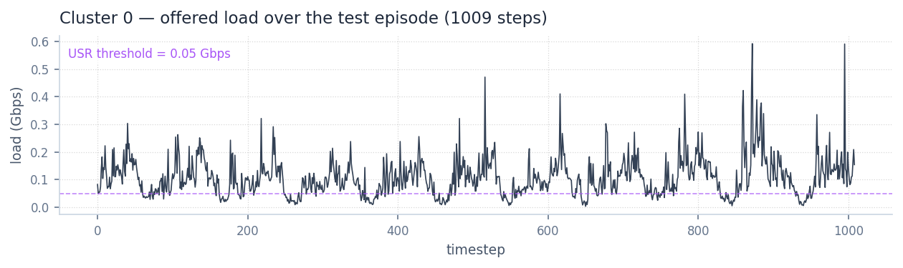
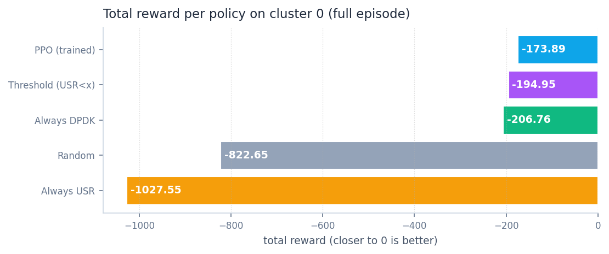
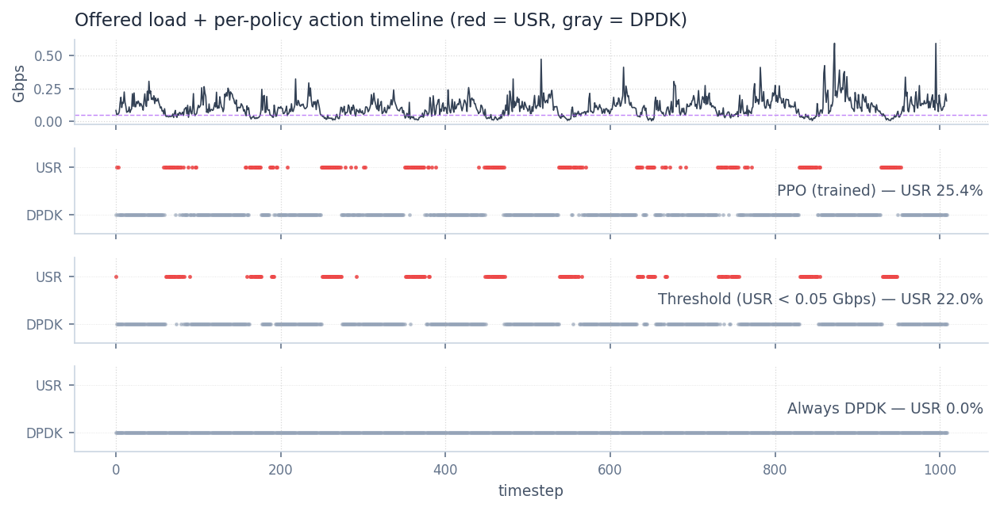
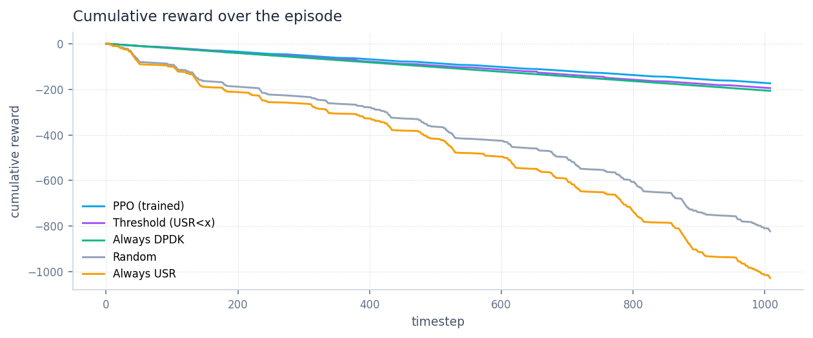

# Phase 2 — Single-Site PPO Sanity Check

**Status:** complete. Trained PPO policy beats every rule-based baseline on
cluster 0 with zero QoS violations. Pipeline and dashboard ready to extend
to multi-site.

## Summary

We trained a Stable-Baselines3 PPO controller on the single-site
Gymnasium environment built in Phase 1, which wraps the
[UpfDigitalTwin](https://github.com/Shima-Af/UpfDigitalTwin) surrogate
for one traffic cluster. The agent's job is to pick one of two UPF
implementations — DPDK (high-throughput, ~0.82 W idle) or USR (lower
power, but QoS-fragile at high loads) — at every 15-minute decision
step over a 1009-step test episode. The reward is a graded penalty that
combines energy, a continuous QoS performance score derived from the
twin's predicted delay and packet loss, and a switching cost; this
shape mirrors the in-house controller used in prior work
(`max(0, 0.90 − performance)` with `qos_lambda = 5.0`), restoring the
gradient that a binary `is_safe` flag had collapsed. After 200 000
training steps (~12 min wall time, ~98 PPO iterations), the
deterministic policy uses USR 25.4 % of the time, makes 110 switches,
and incurs **zero unsafe steps** — strictly better than both
hand-designed baselines we compared against. Total reward improved by
**16 % over always-DPDK** (−173.89 vs −206.76) and **11 % over the
threshold rule** (vs −194.95). The threshold rule statically picks USR
when predicted load is below 0.05 Gbps; PPO discovers a richer,
state-conditional version of the same idea, exploiting brief low-load
windows the static rule misses.

## Cluster 0 traffic profile



The episode's load is bursty around a mean of 0.108 Gbps with p95 at
0.225 Gbps and peaks up to 0.59 Gbps. About 21 % of the steps sit below
the 0.05 Gbps line where the threshold rule (and, as we'll see, PPO)
switch to USR.

## Result — total reward per policy



| Policy | Total reward | Energy Wh | Unsafe steps | USR share | Flips |
|---|---|---|---|---|---|
| **PPO (trained)** | **−173.89** | 173.86 | **0.0 %** | 25 % | 110 |
| Threshold (USR < 0.05) | −194.95 | 180.22 | 0.4 % | 22 % | 61 |
| Always DPDK | −206.76 | 206.76 | 0.0 % | 0 % | 0 |
| Random | −822.65 | 219.09 | 16.4 % | 51 % | 511 |
| Always USR | −1027.55 | 230.77 | 21.7 % | 100 % | 0 |

Higher (closer to zero) is better. PPO is the only policy that
simultaneously improves on always-DPDK in energy *and* matches its
zero-unsafe rate. Random and always-USR collapse — at this cluster's
load profile, the surrogate predicts catastrophic packet loss
(>1000 pkts/interval) for USR above ~0.45 Gbps, so any policy that
sends meaningful traffic to USR at peak loads pays a large QoS penalty.

## How PPO differs from the threshold rule



The top panel is the load. The next three panels are the action chosen
at each timestep by PPO, the threshold rule, and always-DPDK. Two
things stand out:

1. **PPO and threshold use USR for nearly the same fraction of steps**
   (25.4 % vs 22.0 %) — both clearly tracking the low-load regime — but
   PPO commits to USR in shorter, more numerous windows (110 flips vs
   61). It's exploiting brief dips below the threshold that the static
   rule, comparing only the forecast against a fixed cutoff, can't.
2. **PPO's selection achieves zero unsafe steps** while the threshold
   rule has 0.4 % unsafe steps. That difference is small in absolute
   terms but matters: PPO has the safety information from its
   observation (the previous step's `predicted_loss` and `is_safe`
   flag) and uses it; the threshold rule does not.

## Cumulative reward over the episode



The top three lines (PPO, threshold, always-DPDK) bunch together early
and start separating around step 50. PPO's curve stays above both
baselines for the remainder of the episode; the gap is widest in the
high-load regions (around steps 850–1000) where PPO correctly stays
on DPDK while the noise of even a "good" threshold rule introduces
brief USR selections that pay a penalty. Random and always-USR fall
off catastrophically, accumulating QoS penalties whenever USR is asked
to carry load above its safe ceiling.

## How to reproduce

Static figures and the table above:

```bash
python scripts/generate_phase2_report_figures.py
```

Interactive exploration (recommended for a live supervisor demo) —
spin up the FastAPI + React dashboard:

```bash
# terminal 1
uvicorn dashboard.backend.app.main:app --reload --port 8000

# terminal 2
cd dashboard/frontend && npm run dev
```

Then open <http://localhost:5173> and click **Run comparison** to see
the same five policies plotted on overlaid time-series of load, power,
delay, predicted loss, performance, cumulative reward, and actions.
Cluster, horizon, max-steps, and threshold are all live controls.

## Caveats and next steps

- **Single cluster, single horizon.** Cluster 0 has a fairly benign
  load profile. Cluster 1 (mean 0.28 Gbps, peak 1.33 Gbps) and others
  may yield different policies; the same training script handles them
  via `--cluster-idx`.
- **Surrogate extrapolation at load ≈ 0.** The USR layer-1 regressor
  predicts a nonsense delay of ~469 μs at load = 0 (an artefact of
  sparse training data at the edge). PPO learns to avoid the corner;
  fixing it upstream by retraining USR with more low-load samples is
  on the to-do list.
- **Reward weights are placeholders.** `qos_lambda = 5.0` and
  `performance_threshold = 0.90` were chosen to match the prior
  controller's semantics. A sweep across these knobs is one cheap way
  to characterise the safety/energy frontier.

Phase 3 — multi-site centralized PPO — builds directly on this stack:
the env's batched-surrogate trick (~10 μs/step) extends to N clusters
in parallel, and the dashboard's layering is set up for an additional
multi-site view without refactor.
