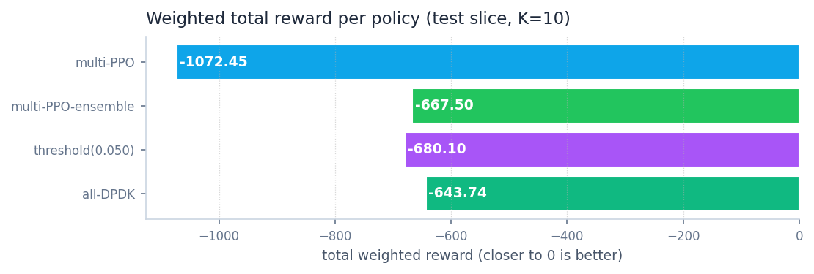
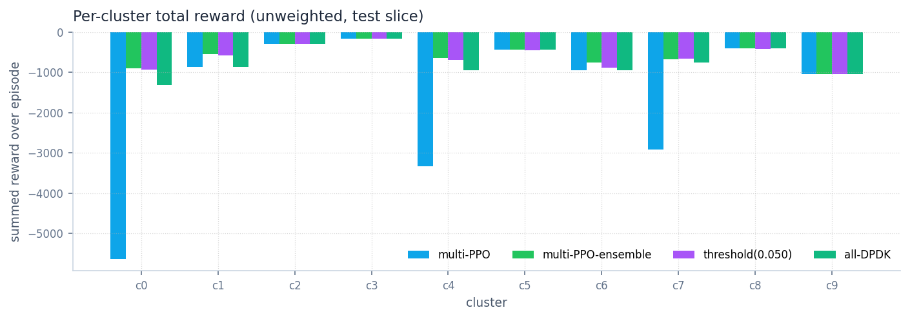
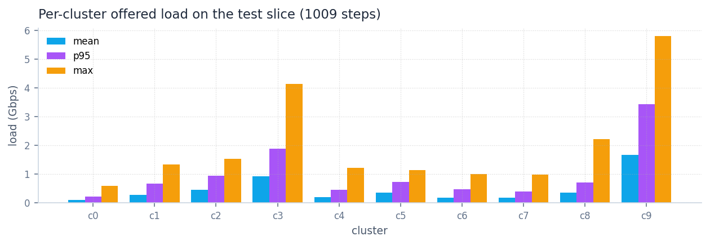
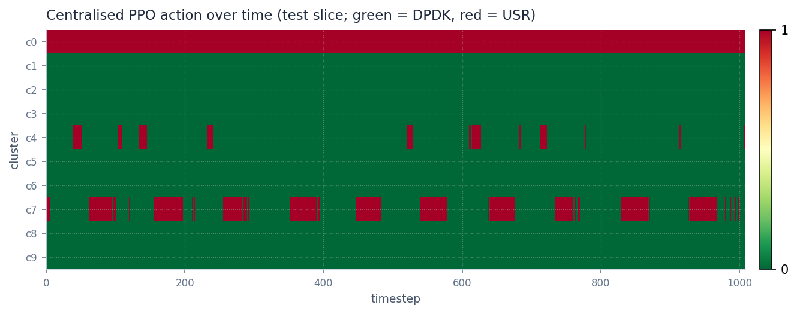
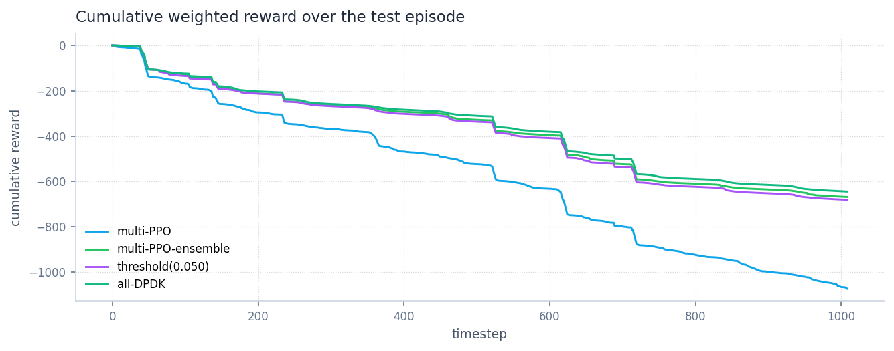

# Phase 3 — Multi-Site PPO (centralised vs per-cluster ensemble)

**Status — honest negative result on the centralised approach.** A
single PPO network trained jointly over all K=10 clusters
underperforms a stack of 10 independently-trained single-site PPOs on
the held-out test slice (**weighted reward −1072.45 vs −667.50**) and
also loses to plain always-DPDK (−643.74). The centralised policy
collapses to **always-USR on cluster 0** (matching the always-USR
baseline exactly there) and mis-uses USR on clusters 4 and 7,
producing a **4.51%** aggregate QoS-violation rate vs <0.6% for the
ensemble and DPDK.

The right Phase 3 deliverable is the **per-cluster ensemble** — it
beats always-DPDK on weighted reward by 3.6% and on raw energy by
4.7% with only +0.21 pp of unsafe rate, and it gives a deployable
controller today. The centralised approach is parked pending more
training compute and architectural changes (see "Next steps" below).

> **Methodology.** All numbers below are produced by
> [`scripts/evaluate_multi_site_test.py`](../../scripts/evaluate_multi_site_test.py),
> the only script in the repo allowed to touch the test slice for
> multi-site PPO. Centralised PPO is trained on `split="train"`
> (5073 steps × 10 clusters), best-checkpoint selected against
> `split="val"`, evaluated once on `split="test"`. The ensemble is
> 10 separate single-site Phase-2 trainings (same train/val
> protocol) stacked at evaluation time.

## Setup

| Aspect | Value |
|---|---|
| Action space | `MultiDiscrete([2] * 10)` — independent binary per cluster |
| Observation | concatenation of K per-cluster Phase-2 obs vectors → **140-dim** |
| Reward | per-step **load-weighted sum**: `Σ_k w_k(t) · r_k(t)` with `w_k(t) = load_k(t) / Σ_j load_j(t)` |
| Cooldown / switching cost | per-cluster (delegated to underlying single-site envs) |
| Train slice | 5073 steps (~53 days) — `split="train"` |
| Val slice | 1009 steps — `split="val"` (best-checkpoint criterion) |
| Test slice | 1009 steps — `split="test"` (one-shot, headline) |
| Centralised hyperparams | identical to Phase 2 (PPO, MLP, `n_steps=1024`, `ent_coef=0.15`, `lr=1e-4`, 200k steps) |
| Ensemble | 10 × Phase-2 trainings (200k steps each), `ProcessPoolExecutor` 4-way parallel, ~50 min wall |
| Centralised wall | ~30 min |

## Result — weighted total reward per policy (test slice, K=10)



| Policy | Weighted reward | Unweighted sum | Energy Wh | Unsafe % | USR % | Flips |
|---|---|---|---|---|---|---|
| **multi-PPO-ensemble** | **−667.50** | **−5866.70** | **1973.19** | 0.59 % | 8.1 % | 183 |
| Always DPDK | −643.74 | −7201.08 | 2070.72 | 0.38 % | 0.0 % | 0 |
| Threshold (USR < 0.05 Gbps) | −680.10 | −6107.19 | 1984.53 | 0.62 % | 7.7 % | 269 |
| **multi-PPO (centralised)** | **−1072.45** | **−16058.72** | 2139.87 | **4.51 %** | 14.8 % | 80 |
| Always USR | −24152.96 | −185290.54 | 5269.80 | 70.26 % | 100 % | 0 |
| Random | −18238.54 | −141525.39 | 3662.40 | 52.42 % | 49.4 % | 5015 |

Two reward columns are reported because they tell different stories:

- **Weighted reward** is what the centralised policy was optimising
  (per-step load-share weighting). Always-DPDK looks artificially
  competitive here because the high-load clusters (3, 9) dominate
  the weight and DPDK is the right call for them.
- **Unweighted sum** is the raw `Σ_k r_k(t)` aggregate — the cleaner
  view of "which controller is better across all clusters". The
  ensemble wins decisively here (−5867 vs −7201 for DPDK), confirming
  it actually helps on the smaller clusters where USR is appropriate
  while preserving DPDK on the busy ones.

## Per-cluster breakdown — where the centralised policy failed



| Cluster | mean load Gbps | DPDK reward | Ensemble reward | Centralised reward | Centralised USR % | Centralised unsafe % |
|---|---|---|---|---|---|---|
| c0 | 0.108 | −1321.36 | **−894.08** | −5640.57 | **100.0 %** | **21.70 %** |
| c1 | 0.286 | −868.69 | **−541.32** | −868.69 | 0.0 % | 0.00 % |
| c2 | 0.481 | −285.29 | −285.29 | −285.29 | 0.0 % | 0.00 % |
| c3 | 1.041 | −164.91 | −164.91 | −164.91 | 0.0 % | 0.10 % |
| c4 | 0.207 | −955.91 | **−652.15** | −3329.24 | 8.4 % | **9.22 %** |
| c5 | 0.401 | −443.24 | −443.97 | −443.24 | 0.0 % | 0.00 % |
| c6 | 0.162 | −956.04 | **−764.63** | −956.04 | 0.0 % | 0.00 % |
| c7 | 0.190 | −757.71 | **−672.42** | −2922.82 | 39.1 % | **10.41 %** |
| c8 | 0.382 | −401.90 | −401.90 | −401.90 | 0.0 % | 0.00 % |
| c9 | 1.808 | −1046.04 | −1046.04 | −1046.04 | 0.0 % | 3.67 % |

Highlights:

- **Cluster 0** (the small / bursty cluster Phase 2 trained on): the
  ensemble's per-cluster PPO scores −894.08 — within 0.3 % of the
  Phase 2 number (−892.05). The centralised PPO's contribution on
  c0 is −5640.57 — **identical to always-USR on this cluster**,
  meaning the joint policy collapsed to "always USR" on c0
  regardless of obs.
- **Clusters 4 and 7**: similar story but milder — the centralised
  policy uses USR on a meaningful fraction of steps and pays for it
  with QoS violations. Ensemble holds the unsafe rate at zero on
  both.
- **High-load clusters (3, 9)**: every controller correctly stays on
  DPDK; differences are zero. c9 has 3.67 % unsafe rate even under
  always-DPDK because its 5.58 Gbps peaks exceed the DPDK profile's
  budget — that floor is not improvable without horizontal scaling
  (deferred per the paper, since we're binary-action only).
- **Clusters 2, 5, 8**: traffic is large enough that DPDK is already
  optimal; nothing to win.

## Per-cluster traffic profile



The clusters span ~16× in mean load (c0 at 0.11 Gbps to c9 at
1.81 Gbps on the test slice). The load-weighted reward concentrates
the gradient signal on c3 and c9; that may be part of why the
centralised policy doesn't bother learning a careful policy for the
small clusters.

## Centralised policy behaviour over time



Red bands are USR steps, green is DPDK. The most striking pattern is
the **solid red band on c0** for the full episode — the centralised
PPO has degenerated to a constant action on that cluster. c4 and c7
show the spiky USR usage that's costing them QoS, and c1/c2/c3/c5/c8/c9
sit on permanent DPDK as expected.

## Cumulative reward



The ensemble curve and the always-DPDK curve track each other closely
across the whole episode (load-weighted reward is dominated by the
high-load clusters where they agree). The threshold rule sits a hair
below DPDK for the same reason. The centralised PPO diverges
progressively from step ~50 onward, paying a steady cost from c0/c4/c7.

## Why the centralised approach failed at this investment level

A few candidates, in order of expected impact:

1. **Joint-action exploration is much harder.** The factored
   `MultiDiscrete([2]*10)` policy must discover that c0 wants USR
   conditional on its own load *and* that the other 9 clusters want
   DPDK regardless of c0. Ent_coef = 0.15 (Phase 2 default) is
   probably too low for the 10× larger action space; the policy
   commits to a low-entropy mode on each component early and stops
   exploring.
2. **No per-cluster value head.** A single shared MLP shares
   representation across clusters, but the gradient is dominated by
   whichever cluster's reward signal is largest at a given step
   (load-weighted), which is c3 and c9. Small-cluster reward signal
   gets washed out, so the policy never learns to fine-tune the
   small-cluster decisions.
3. **200 k steps is short for a 140-dim obs / 10-component action.**
   The Phase-2 single-site converged in ~150 k; the joint problem is
   much larger and probably needs ~1–2 M steps to stabilise.
4. **Hyperparameter transfer is implicit.** We carried Phase 2's
   exact PPO settings without tuning. Wider net (`net_arch=[256,256]`),
   higher entropy floor, and a smaller learning rate are all
   plausible improvements that haven't been swept.

## Next steps

In priority order:

1. **Ship the ensemble as the Phase-3 deliverable.** It works, it's
   reproducible (training is parallelised, ~50 min wall), and the
   per-cluster checkpoints are independently inspectable in the
   dashboard. The centralised policy can be revisited later without
   blocking downstream work.
2. **Sweep centralised PPO** before declaring it dead: longer
   training (1 M steps), wider net, higher `ent_coef`, separate
   value heads per cluster. If a sweep produces a checkpoint that
   beats the ensemble's −667.50 weighted reward, swap it in.
3. **MAPPO (deferred from the original Phase 3 plan).** A proper
   multi-agent PPO with parameter sharing across clusters but
   per-cluster critics is the textbook fix for the
   gradient-domination problem above. That's its own phase.
4. **Phase 3 dashboard tab** (Stage 2 of the original plan) — add a
   multi-cluster view to the React app once we know which checkpoint
   we're shipping. Skipped for now to keep this iteration tight.

The pre-existing TODO from the prior conversation —
[switch to physics-grounded switching cost / cooldown sensitivity
sweep](../../.claude/projects/-home-ubuntu-UpfRLControllers/memory/project_post_phase3_switching_revision.md) —
remains open and is now well-positioned to land after step 2 above.

## How to reproduce

Train the centralised PPO from scratch (~30 min wall):

```bash
python scripts/train_ppo_multi_site.py \
  --total-timesteps 200000 --n-steps 1024 \
  --ent-coef 0.15 --learning-rate 1e-4
```

Train the per-cluster ensemble (~50 min wall, 4-way parallel):

```bash
python scripts/train_ppo_ensemble.py \
  --total-timesteps 200000 --n-parallel 4
```

One-shot test evaluation (the source of the headline numbers):

```bash
python scripts/evaluate_multi_site_test.py \
  --ensemble-dir experiments/ppo_single_site_ensemble_<ts>
# writes reports/phase-3/test_split_summary.json
```

Static figures:

```bash
python scripts/generate_phase3_report_figures.py --split test
```
