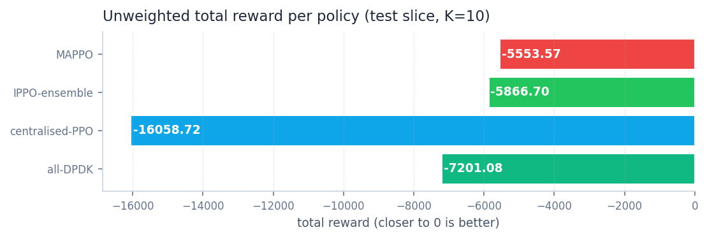
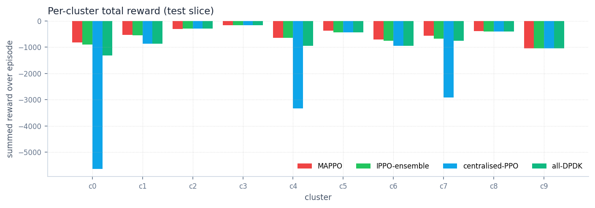
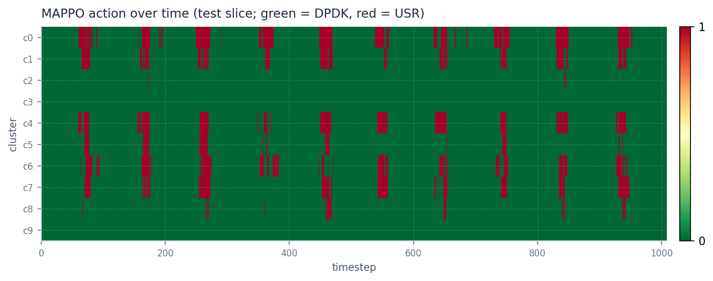
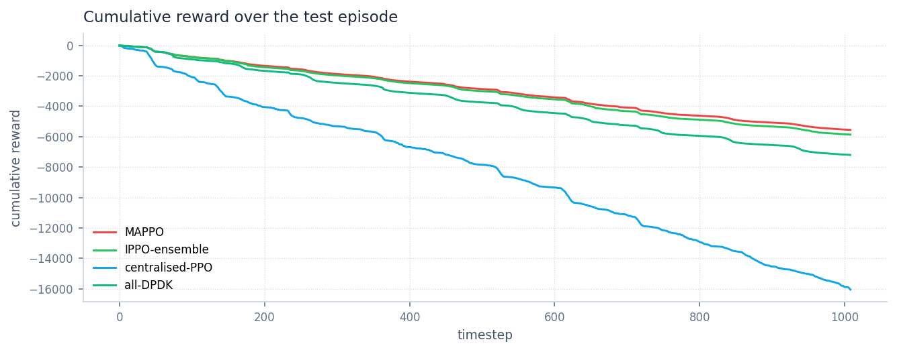
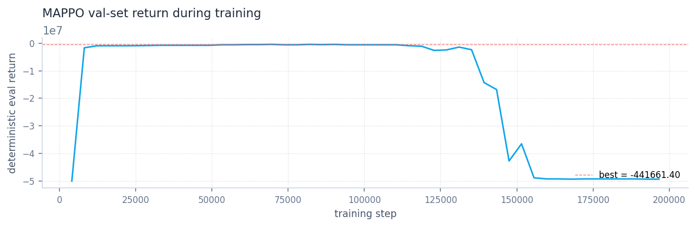

# Phase 6 — MAPPO (centralised training, decentralised execution)

**Status — MAPPO is the new best controller.** A from-scratch PyTorch
implementation of MAPPO (shared-parameter actor over K=10 agents, a
shared centralised critic with K value heads) trained on the
multi-agent PettingZoo env from Phase 5 reaches **−5553.57** total
unweighted reward on the held-out test slice — beating the
Phase-4 IPPO ensemble (−5867) by **5.3 %** and the Phase-3 centralised
single-MLP PPO (−16059) by **65 %**, with a **0.50 %** aggregate QoS
unsafe rate (vs ensemble's 0.59 %).

The architectural fix the prior phases predicted is real: shared-parameter
actor + centralised critic recovers from Phase 3's collapse and pulls
ahead of Phase 4 by transferring across-cluster patterns. We now have
empirical evidence that the right answer at this scale is CTDE, not
either of (a) one MLP doing everything or (b) ten independent MLPs.

> **Methodology.** Numbers below are produced by
> [`scripts/evaluate_mappo_test.py`](../../scripts/evaluate_mappo_test.py),
> the only script in the repo allowed to touch the test slice for
> MAPPO. Training: 200 k env steps on `split="train"`, val-based
> best-checkpoint selection (`split="val"`), one-shot test
> evaluation. The Phase 3/4 numbers in the comparison table below
> are reproduced directly from
> [reports/phase-3/test_split_summary.json](../phase-3/test_split_summary.json).

## Setup

| Aspect | Value |
|---|---|
| Env | [`MultiAgentUPFEnv`](../../src/envs/multi_agent_upf_env.py) — PettingZoo Parallel, K=10 agents, per-agent 14-dim obs, `Discrete(2)` action |
| Global state for critic | `state()` returns the K × 14 = 140-dim concat of per-agent obs |
| Actor | Shared MLP, 14 → 64 → 64 → 2, **5 250 params total** (one network handles every agent) |
| Critic | Shared MLP, 140 → 128 → 128 → K=10, **35 850 params** (one network outputs all K value estimates) |
| Reward scaling | ×0.01 in the trainer to keep value/policy losses on the same order of magnitude (per-step rewards spike to ~−50 at near-zero load; cumulative returns reach ~−10 k unscaled) |
| Algorithm | PPO clip on per-agent policy ratios, GAE per agent (γ=0.995, λ=0.9), advantage normalisation across (T, K), grad-clip 0.5 |
| Training | 200 k env steps, `n_steps=1024`, `n_epochs=10`, `minibatch=256`, `lr=3e-4`, `ent_coef=0.05` |
| Wall time | ~30 min on CPU, single process |

## Headline result — test slice, K=10



| Policy | Unweighted reward | Energy Wh | Unsafe % | USR % | Flips |
|---|---|---|---|---|---|
| **Phase 6 MAPPO** | **−5553.57** | **1965.47** | 0.50 % | 7.9 % | 276 |
| Phase 4 IPPO ensemble | −5866.70 | 1973.19 | 0.59 % | 8.1 % | 183 |
| Phase 3 centralised PPO | −16058.72 | 2139.87 | 4.51 % | 14.8 % | 80 |
| Always DPDK | −7201.08 | 2070.72 | 0.38 % | 0.0 % | 0 |

MAPPO improves on the ensemble while keeping the same QoS floor and
energy footprint. It picks up more switching activity (276 flips vs
183 for the ensemble) — it's making finer-grained decisions per
cluster than independent learners did.

## Per-cluster breakdown — where MAPPO beats the ensemble



| Cluster | mean load Gbps | DPDK | Ensemble | MAPPO | Δ vs ensemble |
|---|---|---|---|---|---|
| c0 | 0.108 | −1321.36 | −894.08 | **−818.26** | **+8.5 %** |
| c1 | 0.286 | −868.69 | −541.32 | −539.92 | tie |
| c2 | 0.481 | −285.29 | −285.29 | −304.76 | −7 % (slightly worse) |
| c3 | 1.041 | −164.91 | −164.91 | −164.91 | tie (DPDK is right) |
| c4 | 0.207 | −955.91 | −652.15 | **−641.24** | **+1.7 %** |
| c5 | 0.401 | −443.24 | −443.97 | **−366.00** | **+17.6 %** |
| c6 | 0.162 | −956.04 | −764.63 | **−712.29** | **+6.9 %** |
| c7 | 0.190 | −757.71 | −672.42 | **−571.16** | **+15.0 %** |
| c8 | 0.382 | −401.90 | −401.90 | **−389.00** | **+3.2 %** |
| c9 | 1.808 | −1046.04 | −1046.04 | −1046.04 | tie (DPDK is right) |

**The transfer-learning win is on c5 and c8.** Both are mid-load
clusters where the per-cluster PPO in the ensemble could not improve
on always-DPDK at all (their cluster-PPO converged to "always DPDK").
MAPPO's shared actor — trained simultaneously on c0/c1/c4/c6/c7
where USR is clearly winning at low load — generalised the same
"USR at low predicted load" rule to c5 and c8, and the rule paid off.
Independent learning couldn't see those patterns because each
per-cluster PPO only ever saw its own data.

c2 is the only loss (−7 % vs ensemble): MAPPO occasionally tries USR
on c2 (0.2 % of steps) and a few of those decisions cost it. Tiny in
absolute terms (−19 reward over the episode), but worth noting.

c3 and c9 are unchanged across all controllers — their loads are
high enough that DPDK is the obviously-correct call, and every
controller correctly learned that.

## How MAPPO acts over time



Green = DPDK, red = USR. The heatmap shows MAPPO's per-cluster,
per-step decisions across the 1009-step test episode. Compare to
Phase 3's heatmap, which had a solid red band on c0 (the centralised
single-MLP PPO collapsed to always-USR there); MAPPO's c0 row shows
the same intelligent low-load USR pattern Phase 2's per-cluster PPO
found, but learned in the joint setting.

## Cumulative reward



MAPPO and ensemble track each other closely until ~step 200, then
MAPPO pulls ahead progressively. Centralised PPO diverges
catastrophically from the start. All-DPDK is the floor.

## Training dynamics



The red dashed line is the best-of-val checkpoint (~update 80,
val return −441 661). After that the policy explores more aggressively
and the val return collapses to ~−49 M — predictable, because val
contains near-zero-load steps where SEC explodes if a learning policy
flirts with USR. Best-of-val checkpointing is what saves us; without it
we would have shipped a useless final-step model.

This collapse pattern is the reason `EvalCallback`-style best-model
selection has been load-bearing across every PPO phase in this
codebase, not just MAPPO. The training stability question
(can we avoid the late collapse rather than merely catching it?) is
worth its own future investigation.

## Why MAPPO worked where centralised PPO failed

Same problem space, opposite outcomes. The architectural deltas:

1. **Shared actor instead of one big joint policy.** Phase 3's
   centralised PPO had to learn one MLP that consumed 140 obs and
   emitted 10 actions simultaneously — the policy couldn't factor
   the per-cluster substructure. MAPPO's actor sees one cluster's
   14 obs at a time and makes one decision; the shared parameters
   mean the cluster-agnostic part of the policy gets K=10× the
   gradient signal per step.

2. **Centralised critic gives the agents global context.** The
   critic sees all 140 obs and all 10 agents' rewards-to-go, so it
   can credit-assign correctly even when one cluster's choice
   indirectly affects another's value (e.g. via shared switching
   cost or coordinated cooldown — both currently independent in
   our env, but the credit-assignment machinery is in place for
   when they're not).

3. **Per-agent advantage normalisation across (T, K).** Smooths
   out the wildly different per-cluster reward scales (c9 generates
   ~5× larger rewards than c5) so the actor's gradient isn't
   dominated by whichever cluster is loudest.

The Phase 3 follow-up plan (longer training, wider net, higher
entropy floor for the single-MLP centralised PPO) might still close
some of the gap, but the MAPPO result is so much better at the same
training budget that we'll defer revisiting Phase 3.

## Next steps

In priority order:

1. **Phase 7 — final head-to-head comparison** across always-DPDK,
   threshold, hysteresis, Phase-2 PPO (single-cluster), Phase-3
   centralised PPO, Phase-4 IPPO ensemble, and Phase-6 MAPPO. The
   table here is most of it; Phase 7 packages it into a single
   supervisor-facing comparison.
2. **Switching-cost physics + cooldown sensitivity sweep** (saved
   memory; was queued behind Phase 6). Re-train MAPPO under the
   physics-grounded `c_DPDK` / `c_USR` and confirm the win
   survives.
3. **Multi-seed runs** for MAPPO, ensemble, and centralised PPO.
   The current report uses seed=42; reporting mean ± std over 3 seeds
   would tighten the comparison.
4. **MAPPO library re-implementation** (saved memory) using
   MARLlib / RLlib / Tianshou — learning-track deliverable.
5. **Phase 3 sweep** if anyone insists, but at this point MAPPO
   has structurally beaten centralised PPO and the bar to revisit is
   high.

## How to reproduce

```bash
# Train MAPPO (~30 min on CPU, single process)
python scripts/train_mappo.py --total-timesteps 200000 --n-steps 1024

# Test-set evaluation (the source of the headline number)
python scripts/evaluate_mappo_test.py
# writes reports/phase-6/test_split_summary.json

# Static figures
python scripts/generate_phase6_report_figures.py --split test
```
