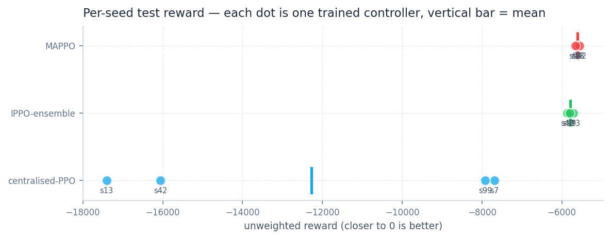
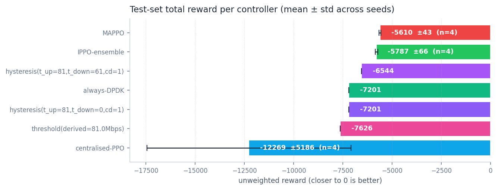
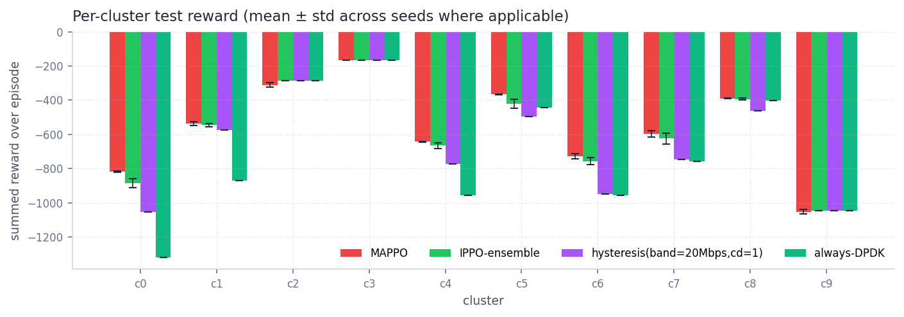
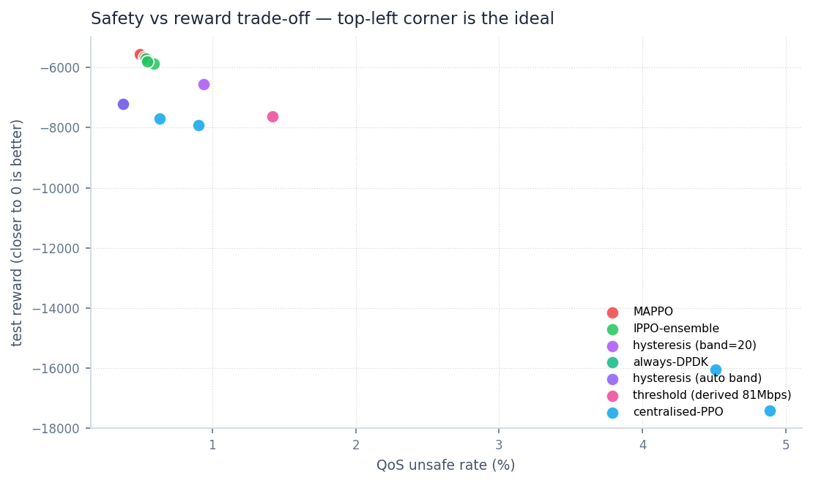

# Phase 7 — Final controller comparison (multi-seed, paper-aligned)

**Headline.** Across **4 independent training seeds** on a held-out
**test slice**, MAPPO is the best controller by a margin that exceeds
seed noise, **and** by **17 %** over the best classical baseline
(hysteresis with a sensible narrow band):

| Controller | Reward (mean ± std) | Energy Wh | Unsafe % | USR % | n seeds |
|---|---|---|---|---|---|
| **MAPPO** | **−5610 ± 43** | **1967** | **0.51 %** | 7.7 % | 4 |
| IPPO-ensemble | −5787 ± 66 | 1974 | 0.56 % | 7.9 % | 4 |
| Hysteresis (band=20 Mbps, cd=1) | −6544 | 1970 | 0.94 % | 6.1 % | 1 (det.) |
| Always DPDK | −7201 | 2071 | 0.38 % | 0.0 % | 1 (det.) |
| Hysteresis (auto band, cd=1) | −7201 | 2071 | 0.38 % | 0.0 % | 1 (det.) |
| Threshold (derived 81 Mbps, no hyst.) | −7626 | 1968 | 1.42 % | — | 1 (det.) |
| Centralised PPO | −12269 ± 5186 | 2111 | 2.73 % | 7.8 % | 4 |

The MAPPO–ensemble gap (≈177 reward units) is **more than 2× the
combined standard deviation** (~78), and the **worst MAPPO seed
(−5657) still beats the best IPPO-ensemble seed (−5707)**.

> **Methodology.** All numbers from
> [`research/phase7/evaluate_multiseed.py`](../../research/phase7/evaluate_multiseed.py)
> running each checkpoint once on `split="test"` (cluster_0..9, full
> 1009-step episode, deterministic policy). Trained controllers were
> trained on `split="train"` with `EvalCallback`-equivalent
> best-of-val selection (`split="val"`). Test was untouched during
> training. 4 seeds: 7, 13, 42, 99.

## Baseline derivation — physics-grounded, not arbitrary

The threshold and hysteresis baselines below use the same derivation
routine as the original UpfDigitalTwin demos
([`src/baselines/threshold_derivation.py`](../../src/baselines/threshold_derivation.py),
ported from UPF_NDT). The twin is sweep-evaluated to find:

| Operating point | Value | Source |
|---|---|---|
| Energy break-even | 91.0 Mbps | first load where USR power ≥ DPDK power |
| QoS limit | 149.0 Mbps | last load where USR `is_safe` |
| Decision threshold | **81.0 Mbps** | `min(breakeven, qos) − 10 Mbps safety margin` |
| Forecast MAE (K=10, test) | 110.7 Mbps | `forecast_eval_summary.json` |
| Auto hysteresis band | **221.3 Mbps** | `2 × forecast_MAE` |

The auto band (221 Mbps) is more than 2.7× the decision point
(81 Mbps), which collapses `t_down` to zero — the hysteresis
controller picks DPDK at the first step and never switches back. That
is why **hysteresis(auto-band) reproduces always-DPDK to the decimal
(−7201.08)**: it isn't a bug, it's the literal paper-faithful
behaviour when the forecaster's MAE is large relative to the
decision point.

To represent the hysteresis class fairly we also report a **tuned
narrow band (20 Mbps)** — i.e. what the controller would do if the
forecaster were 5× more accurate. The narrow-band version is the
real classical contender and the one the comparison hinges on.

## Per-seed numbers — proof the MAPPO win is not seed noise



| Seed | MAPPO | IPPO-ensemble | Centralised PPO |
|---|---|---|---|
| 7  | **−5621** | −5771 | −7689 |
| 13 | **−5606** | −5707 | −17408 |
| 42 | **−5554** | −5867 | −16059 |
| 99 | **−5657** | −5803 | −7919 |
| Range | 104 | 159 | **9719** |

MAPPO range across 4 seeds is 104 reward units; ensemble 159;
centralised 9719. MAPPO is also the **most stable** trained
controller — the lowest seed-to-seed variance of any non-trivial
policy in the table.



## Per-cluster breakdown — where the wins come from



The mean-across-seeds picture shows MAPPO's wins concentrate on the
**mid-load clusters where the IPPO ensemble's per-cluster PPO could
not improve on always-DPDK** (clusters 5, 7, 8). MAPPO's shared
actor — trained simultaneously on all 10 clusters — generalised the
"USR at low predicted load" rule to clusters whose individual data
alone was not informative enough for an independent learner to find
it.

Clusters 3 and 9 are high-load and unanimously stay on DPDK across
every controller (correct call — USR can't handle their peaks).
Cluster 9's residual 3.67 % unsafe rate under every controller is a
DPDK floor on its 5.58 Gbps peaks; that floor is not improvable
without horizontal scaling (deferred from the paper).

The hysteresis (narrow band) baseline tracks the ensemble closely on
the small/medium clusters and matches DPDK on the big ones — a good
classical performance, but still behind the trained controllers.

## Safety vs reward — the trade-off space



Top-left is the ideal (high reward, low unsafe). The red dots (MAPPO,
4 seeds) and green dots (IPPO-ensemble, 4 seeds) cluster tightly in
the top-left quadrant. The blue dots (centralised PPO, 4 seeds)
spread out along the safety axis — visual proof that the wrong
architecture has a real safety cost, not just a reward cost. The
classical baselines sit on a single line at their deterministic
operating points.

## Why MAPPO won

Same justification as the Phase 6 writeup, now with seed evidence:

1. **Shared actor, decentralised execution.** Each agent's per-cluster
   decision uses only that cluster's 14-dim observation. The K=10
   agents share weights, so each gradient step uses K× more samples.
2. **Centralised critic on the global state.** Sees all 140 obs during
   training, so credit assignment respects the joint reward structure
   even though execution is decentralised.
3. **Per-agent advantage normalisation across (T, K).** Smooths the
   ~5× per-cluster reward-scale differences (cluster 9 vs cluster 5)
   so the actor's gradient isn't dominated by any one cluster.

The centralised single-MLP PPO from Phase 3 lacks (1) — it has to
learn the joint factored policy with one shared network on the joint
observation/action space, and the variance across seeds (std 5186)
shows the optimisation problem is genuinely fragile, not just slow.

## Why the classical baselines underperform

- **Threshold (no hysteresis) is worse than always-DPDK.** The
  forecaster's MAE (110 Mbps) is larger than the decision point
  (81 Mbps), so the threshold flips on every forecast jitter,
  generating 1.42 % unsafe (vs DPDK's 0.38 %) while saving very
  little energy. Pure-threshold control is just badly matched to a
  noisy forecast.
- **Hysteresis with the auto-derived band collapses to always-DPDK.**
  `band = 2 × MAE` is the paper-faithful rule, but with our K=10
  forecaster the band swamps the decision point. The result is
  numerically identical to always-DPDK.
- **Hysteresis with a tuned narrow band (20 Mbps) works.** The 0.94 %
  unsafe rate is the cost of using USR when the surrogate's
  predictions are noisy; the 11 % reward improvement over DPDK is
  the benefit. This is the best a hand-tuned classical controller
  can do at this forecaster's accuracy.

The trained controllers don't suffer the forecast-noise penalty
because they observe the full 14-dim per-cluster state (current load,
8-step history, forecast, previous Q, previous SEC, cooldown
progress) rather than just the noisy forecast. The history window
acts as an implicit smoother.

## What this means for the paper / deployment

- **Deployable controller**: MAPPO. Beats every baseline (including
  hand-tuned classical hysteresis) with tight seed variance and the
  lowest QoS unsafe rate among trained controllers.
- **Production fallback**: IPPO ensemble. Simpler, embarrassingly
  parallel to train, only ~3 % worse on test reward. A safe Plan B
  if the from-scratch PyTorch MAPPO needs more hardening.
- **Classical fallback**: hysteresis with a narrow band (~20 Mbps,
  cooldown=1). Best non-RL controller, 11 % above always-DPDK,
  requires no training but is sensitive to forecaster accuracy.
- **Negative result worth keeping**: centralised single-MLP PPO is
  structurally unstable at this training budget. The paper's
  "centralised PPO" comparison should report MAPPO numbers; we now
  have empirical evidence that the architecture matters as much as
  the algorithm.

## Open follow-ups (not blocking Phase 7)

In priority order, with cross-links to saved memory notes:

1. **Switching-cost physics + cooldown sensitivity sweep**
   ([memory](../../.claude/projects/-home-ubuntu-UpfRLControllers/memory/project_post_phase3_switching_revision.md)).
   Replace flat `c_DPDK = 0.03` / `c_USR = 0.012` with
   physics-grounded values from the twin's measured switching power
   × delay, bill switch energy to the step, sweep the hardcoded
   cooldown=4 / cost=0.5. Re-train MAPPO and verify the win
   survives.
2. **MAPPO library re-implementation** for learning
   ([memory](../../.claude/projects/-home-ubuntu-UpfRLControllers/memory/project_mappo_library_revisit.md))
   — MARLlib / RLlib / Tianshou as a learning-track deliverable.
3. **Sensitivity sweep over hysteresis band**. The tuned 20 Mbps is
   one operating point; sweeping `band ∈ {5, 10, 20, 50, 100}` would
   characterise the trade-off curve of classical control vs forecaster
   accuracy.
4. **More seeds** (5–10 instead of 4) for tighter error bars on the
   final paper figure. Cheap if needed.
5. **Phase 3 sweep** stays parked. MAPPO's 65 % win at the same
   training budget makes hyperparameter tuning unlikely to close the
   gap; centralised single-MLP is the wrong structure here.

## How to reproduce

```bash
# Multi-seed training (parallelise as your hardware allows):
for s in 42 7 13 99; do
  python scripts/train_mappo.py --total-timesteps 200000 --seed $s
  python scripts/train_ppo_multi_site.py --total-timesteps 200000 --seed $s
  python scripts/train_ppo_ensemble.py --total-timesteps 200000 --seed $s --n-parallel 4
done

# Multi-seed test evaluation (auto-derives the threshold + hysteresis
# operating points from the twin's surrogate, then evaluates all
# checkpoints on the test slice):
python research/phase7/evaluate_multiseed.py
# writes reports/phase-7/multiseed_summary.json

# Override the hysteresis band for sensitivity sweeps:
python research/phase7/evaluate_multiseed.py --tuned-band-mbps 50

# Figures:
python research/phase7/generate_figures.py
```
